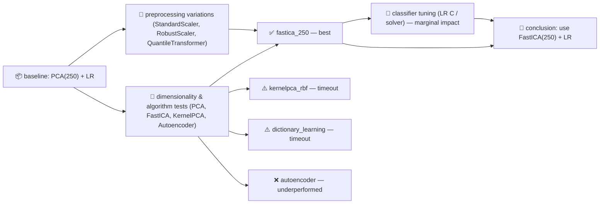
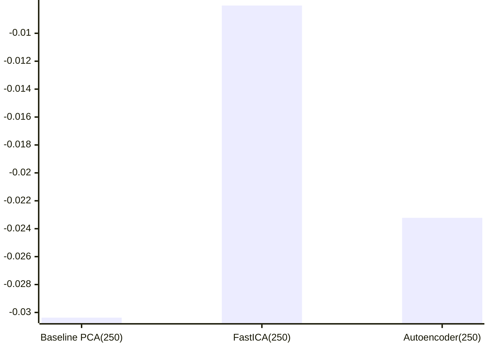

# Skilled Agent Experiment Notes

This document rewrites the original experiment notes with a Mermaid-first, accessible, and concise format. It highlights the key experiments, findings, and recommended next steps.

## 🔬 Overview

The agent ran two experiment batches (run_0 and run_1) exploring dimensionality reduction (PCA, KernelPCA, FastICA, Autoencoders), preprocessing variants, and classifier tuning. The standout result is that FastICA(n_components=250) consistently outperformed PCA and other alternatives.

### Experiment flow

## 📊 Quick quantitative snapshot

## 🔎 Key Findings

- **Best configuration:** FastICA(n_components=250) + LogisticRegression — silhouette = **-0.008012**, precision@10 = **0.241386**. This is a ~74% relative improvement in silhouette over the PCA baseline.
- **Preprocessing:** Adding `StandardScaler` or `RobustScaler` before DR did not improve results; some scalers increased runtime substantially without metric gains.
- **Nonlinear DR:** `KernelPCA` with RBF and `DictionaryLearning` timed out on the compute budget and are impractical at this scale.
- **Autoencoder:** Deep autoencoder underperformed (silhouette = -0.023219) and is not competitive with FastICA here.
- **Classifier tuning:** Changing `LogisticRegression` solver or `C` produced only marginal or no improvements; gains are dominated by the DR choice.
- **Runtime trade-offs:** Several configurations (higher FastICA iterations, some preprocessing combinations) greatly increased runtime with no metric benefit.

## ✅ Recommendation

- Adopt `FastICA(n_components=250)` as the default DR step for this dataset and pipeline.
- Use `LogisticRegression` with default/robust solver settings (saga allowed if convergence issues appear), but avoid long solver/iteration regimes unless justified by metric gains.
- Avoid KernelPCA(rbf) and DictionaryLearning under current resource limits; consider subsampling or GPU-accelerated implementations if non-linear DR is required.

## 🔭 Next steps

1. Evaluate UMAP and HDBSCAN as next-phase candidates for non-linear embedding + clustering (lower cost than KernelPCA for many datasets).
2. If non-linear DR is required, prototype KernelPCA on a small subsample to estimate scaling behavior before full runs.
3. Add a short benchmark script that measures runtime / memory for candidate DR methods so timeouts become predictable.

---

*This file was generated by rewriting `results/agent_experiment_notes.md` into a Mermaid-first, accessible summary.*
